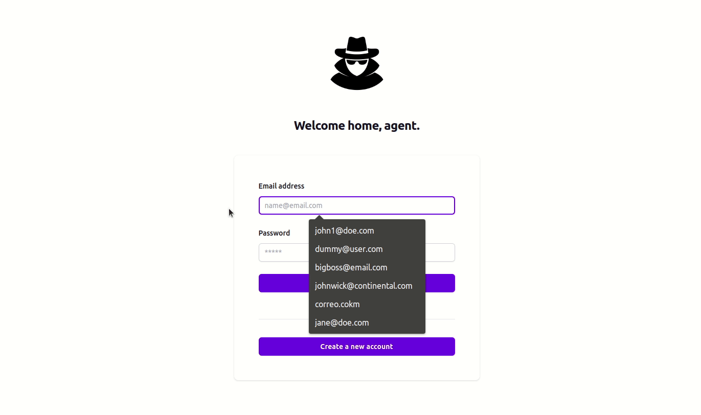
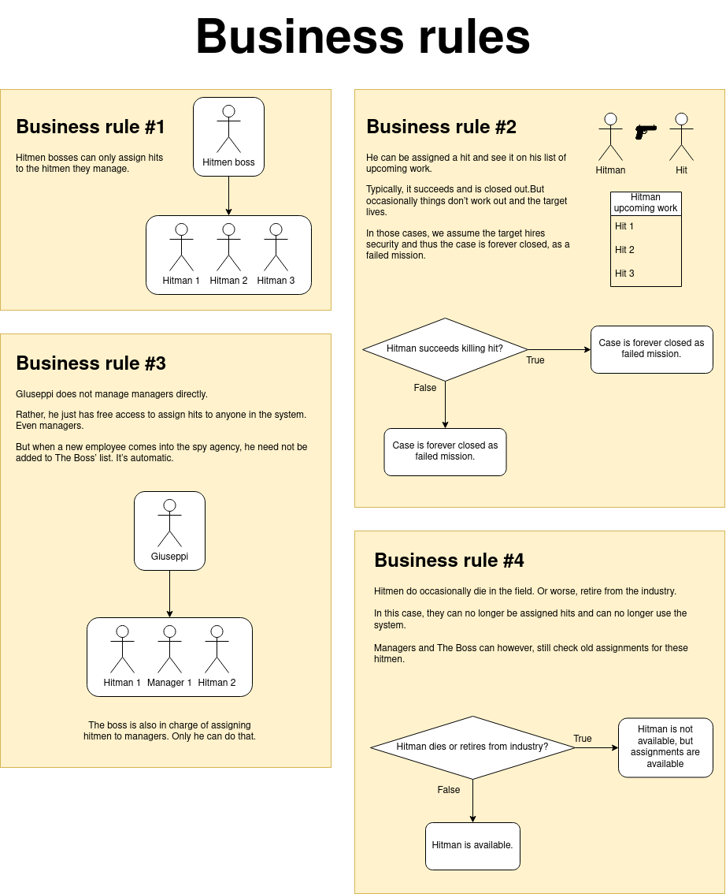
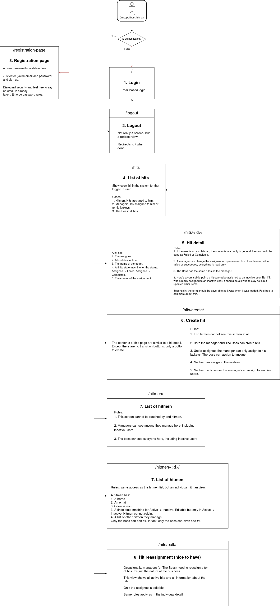
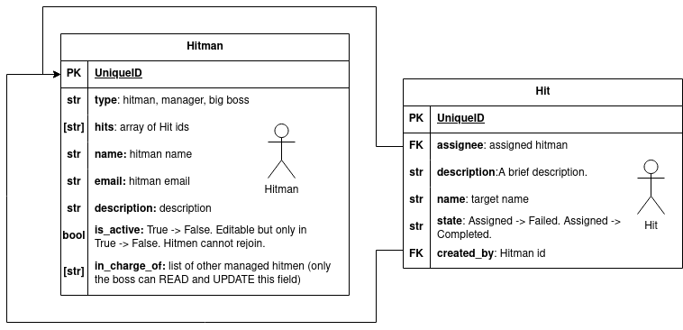

# justo-test

## Final results

Just a glimpse of what you'll see if you run the project locally.

## Used stack

I used Next.js for the front-end, and Django REST with PostgreSQL for the backend. Each of these project are stored in their respective folders:
`spy_agency_frontend` and `spy_agency_backend`.

You will find detailed instructions on how to run the projects within each folder.

-----
## Project management

I used a Trello to track my progress. You can see the board [here.](https://trello.com/b/EDTJa0sE/justo-technical-test)

---------

## Design

Business rules:

---------

## Screens

---------

## Entities relation

